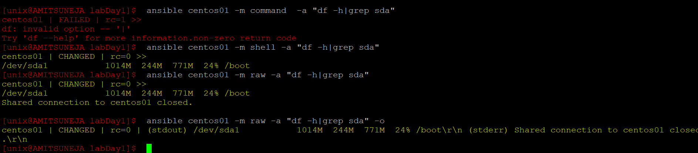
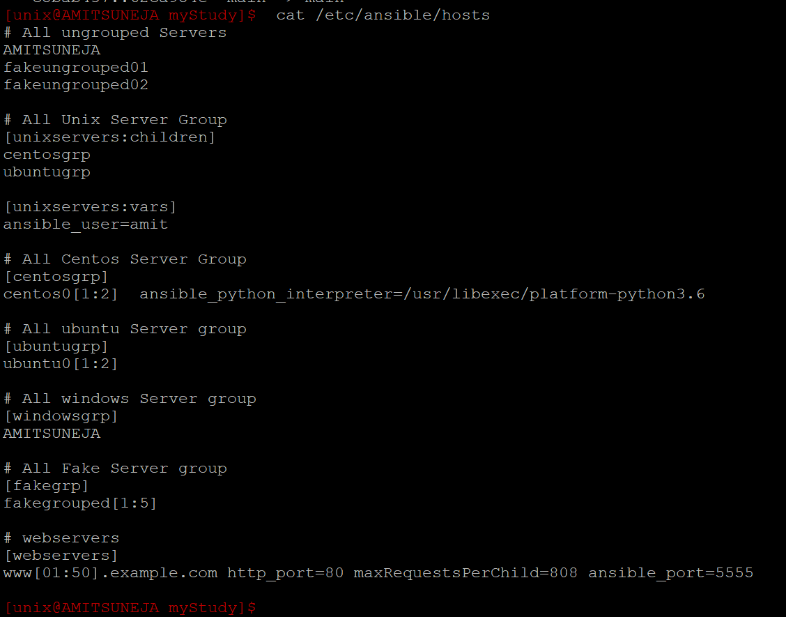
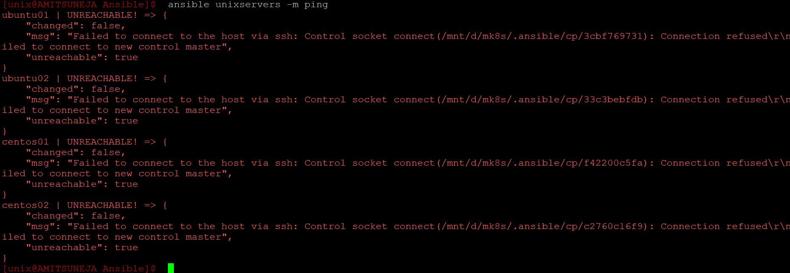
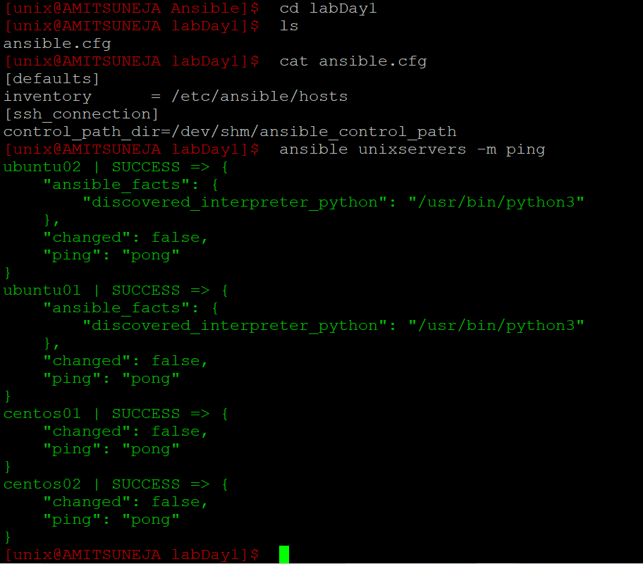
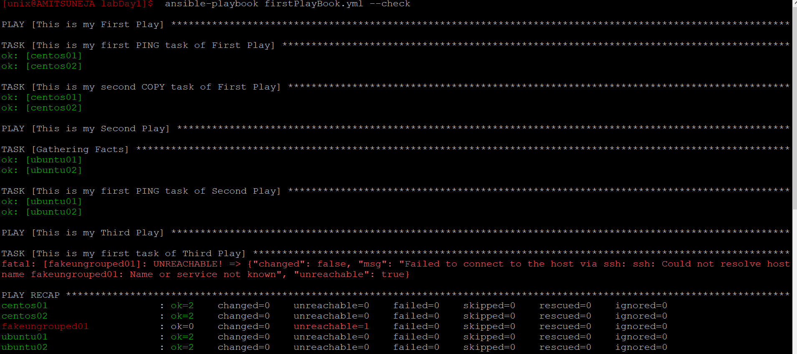
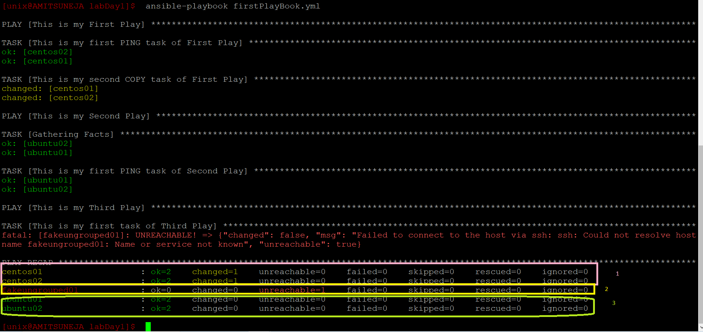

Day1: <br>
https://www.youtube.com/watch?v=0lCKtvtbxiU ---> ansible class 1 <br>
https://www.youtube.com/watch?v=J6FYfbFEgZw ---> ansible class 1 <br>
https://www.youtube.com/watch?v=46PbFvvD0_4 ---> ansible class 1 <br>
https://www.youtube.com/watch?v=uNTOs5Y_twk ---> ansible class 1 <br>
https://www.youtube.com/watch?v=q8_8WtE1RE8 ---> ansible class 1 <br>
https://www.youtube.com/watch?v=p0MjDoiGKS4 ---> ansible class 1 <br>
https://www.youtube.com/watch?v=TLvHriVGW8A ---> ansible class 1 <br>

<b> Important terms:</b><br>
<b>idempotent - </b> Ansible modules are idempotent. means if you create user which id missing then playbook will create for you. But if user already exists , then no changes will be made by playbook. <br>
<b>convergent - </b>If a configuration management system is convergent, then the system may run multiple times to put a server into its desired state, with each run bringing the server closer to that state.
This idea of convergence doesn’t really apply to Ansible,
<br>

<b> lets understand difference between shell , command and raw module ? </b>

<b>Python might not be installed on all the server and appliances. If that’s the case, how to manage those using Ansible?</b><br> 
Ansible offers “raw” module to overcome such a limitation of the “command” module. <br>
<b>What command module cant do?</b><br>
you can’t use the pipe or redirection > in the command module. <br>
<b>What is solution? </b><br>
shell module has that capability<br>
<b> why to use file module to create/delete file and why not shell/ommand module ?</b><br>
Assume you used this playbook to create file on remote centos servers using shell module. 


```
[unix@AMITSUNEJA labDay1]$  cat createFile.yaml
---
- name: "this is my play which will have task"
  hosts: centosgrp
  gather_facts: False
  tasks:
    - name: "this task is to create file using command module"
      shell: echo 123 > /tmp/testfile123.txt
[unix@AMITSUNEJA labDay1]$

```

<b> Note: </b> we did not user command module here as we used pipe in code, so command module will break. might not give any error , but will not create file for you.<br>
we ran it once. <br>
[amit@centos01 tmp]$ ls -ltr /tmp/testfile123.txt <br>
-rw-rw-r--. 1 amit amit 4 Aug  4 12:48 /tmp/testfile123.txt <br>
[amit@centos01 tmp]$ <br>
<br>
we re-ran it and notice it overwrite the file. <br>
[amit@centos01 tmp]$ ls -ltr /tmp/testfile123.txt <br>
-rw-rw-r--. 1 amit amit 4 Aug  4 12:49 /tmp/testfile123.txt <br>
[amit@centos01 tmp]$ <br>
it means it has broken <b>idempotent</b> , thats why we should use specific module fileinline for this task.<br>
lets perform the same task using lineinfile module.

```
[unix@AMITSUNEJA labDay1]$  cat createFile-lineinFileModule.yaml
---
- name: "this is my play which will have task"
  hosts: centosgrp
  gather_facts: False
  tasks:
    - name: "this task is to create file using command module"
      lineinfile:
        path: /tmp/testfile123.txt
        line: 123
        state: present
        create: yes
[unix@AMITSUNEJA labDay1]$
```
We ran createFile-lineinFileModule.yaml 5times and noticed that  it did not break <b>idempotent</b> rules.


  


Switch| Explanation
---|---
-v | verbose (which ansible.cfg file is used, ssh details etc
-k | to enter password of remote machine manually , But then ansible controller must have sshpass package installed.
-m | module example -m ping.
-i | to manually specify inventory file.
-u | to run command with specific user on remote machine.(default it take username of source machine)
--list-hosts| to list the hosts present in inventory . refer to below examples.
--check | dry run
-b | become


File | Tip
---|--- 
/etc/ansible/ansible.cfg | default configuration file on ansible
/etc/ansible/hosts | default inventory file of ansible and it is defined in configuration file


<b>Modules:</b><br>
Module that comes with ansible are written in python, But custom modules can be written in any language.<br>
<b>ansible-doc -l </b>command can be used to list all modules and also its available on website<br>
https://docs.ansible.com/ansible/2.9/modules/list_of_all_modules.html <br>
<b>ansible-doc module_name </b> can be used to see documentation of module. <br>


<b> LabSetup:</b><br>

VM|IPaddress|Function|Notes
---|---|---|---
AMITSUNEJA|172.25.49.236|ansible-control-master|wsl Ubuntu-20.04
centos01|192.168.1.3|ansible client machine| oracle VirtualBox headless
centos02|192.168.1.5|ansible client machine| oracle VirtualBox headless
ubuntu01|192.168.1.2|ansible client machine| oracle VirtualBox headless
ubuntu02|192.168.1.4|ansible client machine| oracle VirtualBox headless

<b> Lab /etc/ansible/hosts </b>

```
[unix@AMITSUNEJA Ansible]$  cat /etc/ansible/hosts
# All ungrouped Servers
AMITSUNEJA
fakeungrouped01
fakeungrouped02

# All Unix Server Group
[unixservers]
centos01
centos02
ubuntu01
ubuntu02
# All Centos Server Group
[centosgrp]
centos0[1:2]

# All ubuntu Server group
[ubuntugrp]
ubuntu0[1:2]

# All windows Server group
[windowsgrp]
AMITSUNEJA

# All Fake Server group
[fakegrp]
fakegrouped[1:5]
[unix@AMITSUNEJA Ansible]$
```

<b> ansible all --list-hosts </b> This will list all the hosts present in inventory


```
[unix@AMITSUNEJA Ansible]$  ansible all --list-hosts
hosts (12):
fakeungrouped01
fakeungrouped02
centos01
centos02
ubuntu01
ubuntu02
AMITSUNEJA
fakegrouped1
fakegrouped2
fakegrouped3
fakegrouped4
fakegrouped5
[unix@AMITSUNEJA Ansible]$
```
<b> ansible ubuntugrp --list-hosts </b> List all hosts present in group ubuntugrp
```
[unix@AMITSUNEJA Ansible]$  ansible ubuntugrp --list-hosts
hosts (2):
ubuntu01
ubuntu02
[unix@AMITSUNEJA Ansible]$
```
<b> ansible ungrouped --list-hosts </b> List all hosts which are not present in any group
```
[unix@AMITSUNEJA Ansible]$   ansible ungrouped --list-hosts
hosts (2):
fakeungrouped01
fakeungrouped02
[unix@AMITSUNEJA Ansible]$
```
<b> List all Group: </b> ansible localhost -m debug -a 'var=groups.keys()'
```
[unix@AMITSUNEJA Ansible]$  ansible localhost -m debug -a 'var=groups.keys()'
localhost | SUCCESS => {
"groups.keys()": "dict_keys(['all', 'ungrouped', 'unixservers', 'centosgrp', 'ubuntugrp', 'windowsgrp', 'fakegrp'])"
}
[unix@AMITSUNEJA Ansible]$
```
<b> List all  Group and Hosts: </b>  ansible localhost -m debug -a 'var=groups'
```
[unix@AMITSUNEJA Ansible]$  ansible localhost -m debug -a 'var=groups'
localhost | SUCCESS => {
"groups": {
"all": [
    "fakeungrouped01",
    "fakeungrouped02",
    "centos01",
    "centos02",
    "ubuntu01",
    "ubuntu02",
    "AMITSUNEJA",
    "fakegrouped1",
    "fakegrouped2",
    "fakegrouped3",
    "fakegrouped4",
    "fakegrouped5"
],
"centosgrp": [
    "centos01",
    "centos02"
],
"fakegrp": [
    "fakegrouped1",
    "fakegrouped2",
    "fakegrouped3",
    "fakegrouped4",
    "fakegrouped5"
],
"ubuntugrp": [
    "ubuntu01",G
    "ubuntu02"
],
"ungrouped": [
    "fakeungrouped01",
    "fakeungrouped02"
],
"unixservers": [
    "centos01",
    "centos02",
    "ubuntu01",
    "ubuntu02"
],
"windowsgrp": [
    "AMITSUNEJA"
]
}
}
[unix@AMITSUNEJA Ansible]$
```

<b> Rule For ansible.cfg file : </b>  variable  ANSIBLE_CONFIG -> current folder > home directory > /etc/ansible/ansible.cfg

<br><br><br>

<b> LAB: </b><br> 
create this directory structure. 2 applications myapp1 and myapp2. Both have there independent inventory. 

```
[unix@AMITSUNEJA Ansible]$  tree ./test
./test
├── myapp1
│   ├── ansible.cfg
│   └── hosts.txt
└── myapp2
├── ansible.cfg
└── hosts.txt
2 directories, 4 files
[unix@AMITSUNEJA Ansible]$  cat test/myapp1/ansible.cfg
[defaults]
inventory      = hosts.txt
[unix@AMITSUNEJA Ansible]$  cat test/myapp1/hosts.txt
ubuntu01
centos01
[unix@AMITSUNEJA Ansible]$  cat test/myapp2/ansible.cfg
[defaults]
inventory      = hosts.txt
[unix@AMITSUNEJA Ansible]$  cat test/myapp2/hosts.txt
ubuntu02
centos02
```

<br>
Now go to myapp1 and myapp2 folder and run command ansible all -m ping and notice the difference. Ignore the permission error which is ok for now.
<br>


```
[unix@AMITSUNEJA myapp1]$  ansible all -m ping
ubuntu01 | UNREACHABLE! => {
"changed": false,
"msg": "Failed to connect to the host via ssh: unix@ubuntu01: Permission denied (publickey,password).",
"unreachable": true
}
centos01 | UNREACHABLE! => {
"changed": false,
"msg": "Failed to connect to the host via ssh: unix@centos01: Permission denied (publickey,gssapi-keyex,gssapi-with-mic,password).",
"unreachable": true
}
[unix@AMITSUNEJA myapp1]$  cd ../myapp2
[unix@AMITSUNEJA myapp2]$  ansible all -m ping
ubuntu02 | UNREACHABLE! => {
"changed": false,
"msg": "Failed to connect to the host via ssh: unix@ubuntu02: Permission denied (publickey,password).",
"unreachable": true
}
centos02 | UNREACHABLE! => {
"changed": false,
"msg": "Failed to connect to the host via ssh: unix@centos02: Permission denied (publickey,gssapi-keyex,gssapi-with-mic,password).",
"unreachable": true
}
[unix@AMITSUNEJA myapp2]$
```

<br>
Now lets modify the inventory file hosts.txt in myapp1


```
[unix@AMITSUNEJA myapp1]$  ls
ansible.cfg  hosts.txt
[unix@AMITSUNEJA myapp1]$  cat ansible.cfg
[defaults]
inventory      = hosts.txt
[unix@AMITSUNEJA myapp1]$  cat hosts.txt
ubuntu01 ansible_host=203.0.113.111 ansible_user=dbaadmin
centos01 ansible_host=192.168.1.3 ansible_user=amit
[unix@AMITSUNEJA myapp1]$
```

<b> Note: Observe that we have given incorrect IP for host ubuntu01 because its read ip in /etc/hosts is 192.168.1.2 but we have given 203.0.113.111 to prove that IP mentioned in inventory will take preseidence over actual Ip of host. <br>
Note: Also observe that how we mentioned user on remote machine in inventory itself. And now even if you give user on command line with -u switch that is ineffective
</b>

```
[unix@AMITSUNEJA myapp1]$  ansible all -u testuser -m ping
centos01 | UNREACHABLE! => {
    "changed": false,
    "msg": "Failed to connect to the host via ssh: amit@192.168.1.3: Permission denied (publickey,gssapi-keyex,gssapi-with-mic,password).",
    "unreachable": true
}
ubuntu01 | UNREACHABLE! => {
    "changed": false,
    "msg": "Failed to connect to the host via ssh: ssh: connect to host 203.0.113.111 port 22: Connection timed out",
    "unreachable": true
}
[unix@AMITSUNEJA myapp1]$

```

Note: ansible SOMEIP -m ping  (make sure IP exist in inventory else it wont work.<br>

Note: We made changes in lab.<br>
      1. ensure username amit is created in all the lab servers.(useradd amit)<br>
      2. created sudo group in all the lab servers.(groupadd sudo)<br>
      3. added user amit to group sudo. (usermod -a -G sudo amit)<br>
      4. edit the sudoers file and added this line .<br>
         %sudo   ALL=(ALL) NOPASSWD:ALL<br>


<b> LAB: </b>

we modified /etc/ansible/hosts and coverted [unixservers] to [unixservers:children] and also added <br>
[unixservers:vars] , and also specified one ansible_python_interpreter=/usr/libexec/platform-python3.6


<b>Note: </b><br>
Child groups have a couple of properties to note: <br>
	1. Any host that is member of a child group is automatically a member of the parent group. <br>
	2. A child group’s variables will have higher precedence (override) a parent group’s variables. <br>
	3. Groups can have multiple parents and children, but not circular relationships. <br>
	4. Hosts can also be in multiple groups, but there will only be one instance of a host, merging the data from the multiple groups <br>
<br>

Now we try to ping all the [unixservers] , but we get error.<br>

we created dirctory labDay1 and with in that directory we customize the variable control_path_dir and issue get fixed


<br>
Now we created first playbook.Playbook contain number of plays and each play consist of number of tasks and each task contains ansible module. 

```
---
- name: "This is my First Play"
  hosts: centosgrp
  become: True
  become_user: root
  gather_facts: False
  tasks:
    - name: "This is my first PING task of First Play"
      ping:
    - name: "This is my second COPY task of First Play"
      file:
        path: /tmp/testfile.txt
        state: touch

- name: "This is my Second Play"
  hosts: ubuntugrp
  gather_facts: True
  tasks:
    - name: "This is my first PING task of Second Play"
      ping:

- name: "This is my Third Play"
  hosts: fakeungrouped01
  become: True
  become_user: root
  gather_facts: False
  tasks:
    - name: "This is my first task of Third Play"
      ping:
```

<br>
 
<br>
in above command we used --check option which is like --dry-run
 
we ran above command without --check now which actully made changes.<br>
marked area 1 -> changed= 1 means 1 task made change on centos01 and centos02 , which is touch command.<br>
and ok=2 both tasks PING and COPY are ok. (note gather_facts: was false)<br><br>
marked area 2> changed=0 means no changes in host fakeungrouped01 , unreachable=1 means 1 host fakeungrouped01 is unreachable.<br><br>
marked area 3> ok = 2 means 2 tasks (1st gater_fact: true and 2nd is PING) are ok. But  changed= 0 means neither PING task not gater_fact task made any changes to server.<br><br>

<br>
<b>Note: Variable presedency </b><br>
1. if centos01 has defined variable ansible_user then it will take first priority irrespective of selfgroup:var and parents:var <br>
2. if centos01 has not defined variable ansible_user But it is present in selfgroup:var and parents:var, then selfgroup:var will be effective not parents:var <br>
3. if centos01 has not defined variable ansible_user and also not defined it its selfgroup:var  , but parents:var have defined thern parents:var will be effective <br>
4. if variable ansible_user is not defined for self, selfgroup:var and parents:var then cli -u some_random_user will be used. But if any of these 3 (self, selfgroup:var and parents:var) is present then -u some_random_user will be ignoed. <br>

